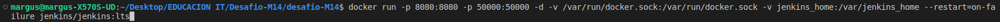

# desafio-M14

La idea final de la aplicacion seria que cuando te llega la cuenta por dar un ejemplo en un restaurante, y al momento de pagar, los comensales quieren pagar todos con mercadopago, es un chino, ya que cuando escaneas el QR te pone el monto total a pagar. Entonces, en este caso, cuando vos escanees el codigo QR, te va a llevar a una pagina, donde te va a pedir la cantidad de personas que son en total, que ingreses los mails de sus cuentas de mercadopago, le vas a dar enviar y a cada uno le va a llegar una notificacion a su mercagopago con el monto a pagar, y asi para cada uno de los usuarios. Una vez que pagaron todos, automaticamente al que escaneo el QR, le sale como que el monto fue pagado en su totalidad. Ademas, genera un QR para cada uno de los usuarios, por si por algun motivo no llego la notificacion, entonces escaneando el QR, lo va a llevar directo a mercadopago para que realice el pago.

NOTAS: Como veran, tambien corre un postgres, la idea de esto es dejar un registro de todas las transacciones, por el momento corre en el mismo contenedor, pero mi idea a futuro es que corran en distintos contenedores.

Para levantar dicha aplicacion, vas a tener que estar parado en la carpeta desafio-M14 y ejecutar el script "run.sh", el cual levanta la aplicacion y pushea la imagen a DockerHub.

Una vez terminado, vas a ingresar a la siguiente direccion en el navegador que desees http://localhost:5000 y vas a poder ver el funcionamiento de la misma.

Todavia es una version BETA, tengo varias cosas para seguir mejorando, que espero poder hacerlo en los proximos desafios.

Saludos.
