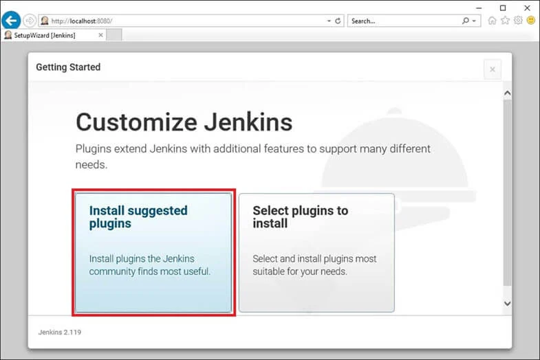

## APP-QR ##

La idea final de la aplicacion seria que cuando te llega la cuenta por dar un ejemplo en un restaurante, y al momento de pagar, los comensales quieren pagar todos con mercadopago, es un chino, ya que cuando escaneas el QR te pone el monto total a pagar. Entonces, en este caso, cuando vos escanees el codigo QR, te va a llevar a una pagina, donde te va a pedir la cantidad de personas que son en total, que ingreses los mails de sus cuentas de mercadopago, le vas a dar enviar y a cada uno le va a llegar una notificacion a su mercagopago con el monto a pagar, y asi para cada uno de los usuarios. Una vez que pagaron todos, automaticamente al que escaneo el QR, le sale como que el monto fue pagado en su totalidad. Ademas, genera un QR para cada uno de los usuarios, por si por algun motivo no llego la notificacion, entonces escaneando el QR, lo va a llevar directo a mercadopago para que realice el pago.

NOTAS: Como veran, tambien corre un postgres, la idea de esto es dejar un registro de todas las transacciones, por el momento corre en el mismo contenedor, pero mi idea a futuro es que corran en distintos contenedores.

Todavia es una version BETA, tengo varias cosas para seguir mejorando, que espero poder hacerlo en los proximos desafios.

## DESAFIO M14 ##

Para poder probar la aplicacion, lo primero que vamos a tener que hacer es clonarnos el Repositorio. Para ello, dentro de la terminal de Visual Studio Code, vamos a ejecutar el siguiente comando:

- git clone https://github.com/martinlopez5/desafio-M14.git

Una vez que tenemos el Repositorio clonado en nuestro local, vamos a dirigirnos al directorio 'App-QR', donde se encuentra todo lo necesario para que la App funcione.

- cd App-QR

Dentro del directorio App-QR, vamos a ver que hay un Script 'run.sh', el cual al ejecutarlo crea la imagen, el contenedor y sube la imagen a DockerHub. Para correrlo, vamos a tener que ejecutar el siguiente comando:

- sh run.sh

Aca podemos ver el proceso del script:

Una vez terminado, vas a ingresar a la siguiente direccion en el navegador que desees http://localhost:5000 y se va a poder ver el funcionamiento de la misma.

Tambien podemos ingresar a nuestra cuenta de DockerHub y revisar que la imagen se haya subido correctamente.

## DESAFIO M15 ##

# JENKINS #

Para este Desafio, lo podemos realizar de 2 formas. La opcion Nº1 es si estamos trabajando desde Windows, y la opcion Nº2 es si estamos trabajando desde Linux. (Aunque tambien se puede usar el Nº1 desde Linux). En este caso, utilice la opcion Nº2 ya que trabajo desde Linux.

Lo primero que vamos a realizar es la instalacion de Jenkins, para ello vamos a ejecutar el siguiente comando:

- docker run -p 8080:8080 -p 50000:50000 -d -v /var/run/docker.sock:/var/run/docker.sock -v jenkins_home:/var/jenkins_home --restart=on-failure jenkins/jenkins:lts

Una vez que corrimos dicho comando, vamos a correr el siguiente comando, para revisar que nuestro contenedor de Jenkins este funcionando:

- docker ps

Como podemos ver, esta corriendo ok, con lo cual ahora vamos a proceder a instalar Jenkins dentro de nuestro contenedor, para ello vamos a ejecutar el siguiente comando:

- docker exec -it --user root <container id> bash

Una vez dentro de nuestro contenedor, vamos a ejecutar el siguiente comando, para realizar la instalacion de Docker:

- curl https://get.docker.com/ > dockerinstall && chmod 777 dockerinstall && ./dockerinstall

Cuando la instalacion haya finalizado, vamos a escribir 'exit', para salir de nuestro contenedor y vamos a ejecutar el siguiente comando en nuestra terminal:

- sudo chmod 666 /var/run/docker.sock

De esta forma, ya vamos a tener funcionando Docker en nuestro conteneder, ahora vamos a proceder a ingresar a Jenkins, para ello abrimos el navegador de nuestra preferencia, e ingresamos a la siguiente URL:

- http://localhost:8080

Aca nos va a pedir que ingresemos la InitialPassword, para ello volvemos a nuestra consola y ejecutamos el siguiente comando:

- docker exec -it sharp_snyder cat /var/jenkins_home/secrets/initialAdminPassword

Pegamos la Password que nos aparece en pantalla y clickeamos en Continue. La proxima pantalla nos va a pedir que creemos nuestro usuario y password.

Luego nos va a pedir que instalemos los Plugins, en este caso seleccionamos la opcion 'Install Suggested Plugins'

Una vez que haya finalizado la instalacion de los Plugins, ya vamos a estar dentro de Jenkins. Para poder crear nuestro Pipeline vamos a hacer click en la opcion 'New Task'.

Vamos a ingresar el nombre de nuestro Pipeline y seleccion la opcion 'Multibranch Pipeline' y le damos a Continue.

En la parte de 'Branch Sources', vamos a ingresar la URL de este repositorio.

Bajamos un poco mas, y en la parte de 'Build Configuration', vamos a escribir la ruta de nuestro Jenkinsfile, que en este caso es Jenkins/Jenkinsfile. Y como ultimo paso, hacemos click en Apply y luego a Save.

Antes de correr el Pipeline, tenemos que cargar nuestras credenciales de DockerHub, para que pueda subir la imagen. Para ello, vamos al inicio de Jenkins e ingresamos a la opcion 'Administrar Jenkins'.

Luego vamos a la opcion 'Credentials'.

Ingresamos en 'System'.

Ahora ingresamos en 'Global Credentials'.

Clickeamos en 'Add Credentials'.

Cargamos nuestras credenciales.

Ahora si, ingresamos a nuestro Pipeline.

Una vez dentro, vamos a ver que esta creado uno con el nombre de nuestra rama, en este caso 'main', y le damos al simbolo de play, para correr el mismo.

Vamos a ver que empieza a correr.

Ingresamos al mismo, y vamos a poder ver el paso a paso.

Ingresamos al ultimo, que en este caso es el #6. Y vamos a la opcion de 'Console Output', donde vamos a poder ver todo el proceso.

Y como paso final, vamos a ingresar a nuestra cuenta de DockerHub, para ver si pusheo la imagen correctamente. La cual tendria que tener el Tag 6.0.

# GITHUB ACTIONS #

Saludos.
